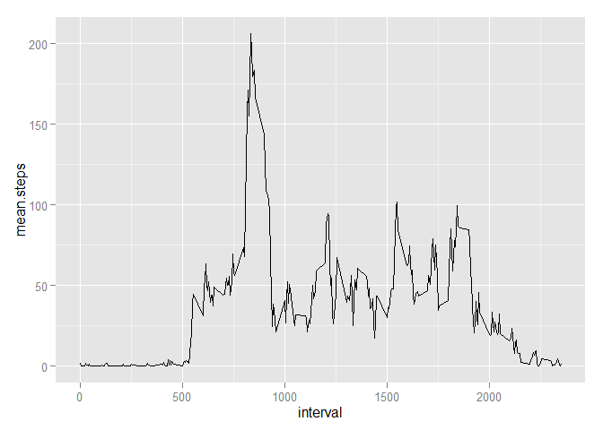
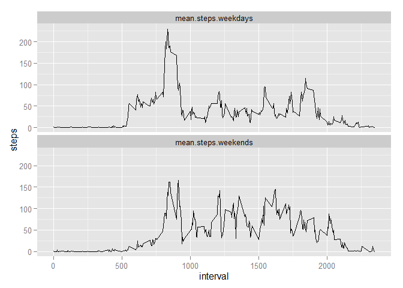

# Reproducible Research: Peer Assessment 1


## Loading and preprocessing the data

```r
data = read.csv("activity.csv")
data$interval.factor = as.factor(data$interval)
```

## What is mean total number of steps taken per day?
Compute daily number of steps and observations available 

```r
daily.steps = tapply(data$steps,data$date,sum,na.rm=TRUE)
```

Create data frame with daily data

```r
daily.data = data.frame(date=names(daily.steps),steps=daily.steps)
```

Plot histogram of daily number of steps

```r
library(ggplot2)
ggplot(daily.data, aes(x=steps)) + geom_histogram()
```

 

Calculate mean and median number of steps

```r
mean(daily.data$steps)
```

```
## [1] 9354.23
```

```r
median(daily.data$steps)
```

```
## [1] 10395
```

## What is the average daily activity pattern?
Compute per-interval number of steps, observations available, and mean number of steps 

```r
interval.mean = tapply(data$steps,data$interval,mean,na.rm=TRUE)
```

Create data frame with per-interval data

```r
interval.data = data.frame(interval=as.numeric(names(interval.mean)),mean.steps=interval.mean)
```
Time series plot

```r
ggplot(interval.data) + geom_line(aes(x=interval, y=mean.steps))
```

 

Compute maximum average number of steps and corresponding interval

```r
interval.data$mean.steps[which.max(interval.data$mean.steps)]
```

```
##      835 
## 206.1698
```

## Imputing missing values
Calculate total number of rows with NAs

```r
sum(apply(data,1,anyNA))
```

```
## [1] 2304
```

Create new data set filling NA with the mean for each corresponding 5-minute interval

```r
newData = data
newData$steps[is.na(newData$steps)] = interval.data$mean.steps[as.numeric(newData$interval.factor[is.na(newData$steps)])]
```

Compute daily number of steps and observations available on new data set

```r
daily.steps.new = tapply(newData$steps,newData$date,sum)
```

Create data frame with daily data

```r
daily.data.new = data.frame(date=names(daily.steps.new),steps=daily.steps.new)
```

Plot histogram of daily number of steps

```r
library(ggplot2)
ggplot(daily.data.new, aes(x=steps)) + geom_histogram()
```

 

Calculate mean and median number of steps

```r
mean(daily.data.new$steps)
```

```
## [1] 10766.19
```

```r
median(daily.data.new$steps)
```

```
## [1] 10766.19
```

The previous histogram had a large count for a number of steps equal to zero
due to the missing values for certain days. This in turn would yield an artificially
low mean and median number of steps, which is corrected when using the new data set with filled values. The new data set contains a large count exactly on the mean value, corresponding to days where data has been filled.

## Are there differences in activity patterns between weekdays and weekends?

Create new factor variable indicating weekday or weekend

```r
newData$dayOfWeek = weekdays(as.Date(newData$date))
newData$dayType = "weekday"
newData$dayType[newData$dayOfWeek=="Saturday" | newData$dayOfWeek=="Sunday"]= "weekend"
newData$dayType=as.factor(newData$dayType)
```

Compute per-interval mean number of steps for weekdays and weekends 

```r
data.weekdays = subset(newData,dayType=="weekday")
data.weekends = subset(newData,dayType=="weekend")
interval.mean.wdays = tapply(data.weekdays$steps,data.weekdays$interval,mean,na.rm=TRUE)
interval.mean.wends = tapply(data.weekends$steps,data.weekends$interval,mean,na.rm=TRUE)
```

Create data frame with per-interval data

```r
library(reshape2)
interval.data.new = data.frame(interval=as.numeric(names(interval.mean.wdays)),mean.steps.weekdays=interval.mean.wdays,mean.steps.weekends=interval.mean.wends)
interval.data.new = melt(interval.data.new,measure.vars=c("mean.steps.weekdays","mean.steps.weekends"),value.name="steps")
```
Time series plot

```r
ggplot(interval.data.new) + geom_line(aes(x=interval, y=steps))+facet_wrap(~variable,nrow=2,ncol=1)
```

 

Data for weekdays shows a larger number of step in the morning followed by a reduced number of steps at typical working hours. Conversely, data on weekends shows activity starting and finishing at later hours, and  more constant throughout the day.
